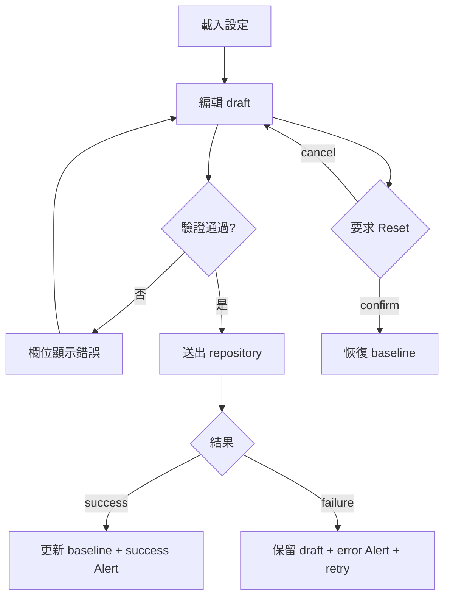

# 實際業務案例：跨平台帳號設定

本案例從需求、資料模型、驗證、狀態、repository、UI 到測試完整拆解。目標不是只做出表單，
而是建立可以失敗、恢復、測試並同時用於 Desktop/Web 的產品流程。

## 需求

使用者可以：

- 編輯顯示名稱與 Email。
- 選擇方案與產品更新通知。
- 調整用量警示門檻。
- 儲存變更。
- 儲存失敗後保留草稿並 retry。
- 重設到最近一次成功儲存的 baseline。

## 使用者流程



## Model

```kotlin
enum class AccountPlan { Free, Pro, Enterprise }

data class AccountSettings(
    val displayName: String,
    val email: String,
    val plan: AccountPlan,
    val productUpdates: Boolean,
    val warningThreshold: Float,
)
```

使用 typed model，不以 `Map<String, Any?>` 傳遞表單。編譯器才能協助檢查欄位與重構。

## 純驗證

```kotlin
data class AccountSettingsValidation(
    val displayNameError: String? = null,
    val emailError: String? = null,
    val thresholdError: String? = null,
) {
    val isValid: Boolean
        get() = displayNameError == null &&
            emailError == null &&
            thresholdError == null
}

fun validateAccountSettings(value: AccountSettings) = AccountSettingsValidation(
    displayNameError = if (value.displayName.isBlank()) "顯示名稱必填" else null,
    emailError = FormValidators.email().validate(value.email).message,
    thresholdError = if (value.warningThreshold !in 0f..100f) {
        "警示門檻必須介於 0 到 100"
    } else {
        null
    },
)
```

驗證是純函式：沒有 Composable、network 或 database，因此可快速測試。

## Repository contract

```kotlin
interface AccountSettingsRepository {
    suspend fun load(): AccountSettings
    suspend fun save(value: AccountSettings)
}
```

Shared 只需要 contract。Desktop 可以用 local database/HTTP，Web 可以用 fetch/client；兩者都把
技術錯誤轉成產品可顯示的 domain error。

## UI state

```kotlin
data class AccountSettingsUiState(
    val baseline: AccountSettings,
    val draft: AccountSettings,
    val validation: AccountSettingsValidation,
    val saving: Boolean = false,
    val saved: Boolean = false,
    val saveError: String? = null,
    val resetConfirmationVisible: Boolean = false,
) {
    val dirty: Boolean get() = draft != baseline
    val canSave: Boolean get() = dirty && validation.isValid && !saving
}
```

### 為什麼同時保存 baseline 與 draft

- 使用者輸入只修改 draft。
- 儲存成功才把 draft 提升為 baseline。
- 儲存失敗保留 draft。
- Reset 回到最近成功儲存的 baseline，不是過期 initial value。

## 事件

```kotlin
sealed interface AccountSettingsIntent {
    data class NameChanged(val value: String) : AccountSettingsIntent
    data class EmailChanged(val value: String) : AccountSettingsIntent
    data class PlanChanged(val value: AccountPlan) : AccountSettingsIntent
    data class UpdatesChanged(val value: Boolean) : AccountSettingsIntent
    data class ThresholdChanged(val value: Float) : AccountSettingsIntent
    data object Save : AccountSettingsIntent
    data object ResetRequested : AccountSettingsIntent
    data object ResetConfirmed : AccountSettingsIntent
    data object ResetDismissed : AccountSettingsIntent
    data object ErrorDismissed : AccountSettingsIntent
}
```

使用 intent 不是硬性規定，但它能讓事件名稱與責任明確，也方便 reducer/ViewModel 測試。

## UI 組合

```kotlin
@Composable
fun AccountSettingsContent(
    state: AccountSettingsUiState,
    onIntent: (AccountSettingsIntent) -> Unit,
) {
    Column(verticalArrangement = Arrangement.spacedBy(16.dp)) {
        H1("帳號設定")
        Lead("管理個人資料、方案與通知偏好。")

        if (state.saved) {
            Alert("設定已更新", tone = Tone.Success)
        }
        state.saveError?.let { message ->
            Alert(
                message = message,
                title = "儲存失敗",
                tone = Tone.Danger,
                dismissible = true,
                onDismiss = { onIntent(AccountSettingsIntent.ErrorDismissed) },
            )
        }

        FormSection(title = "個人資料") {
            FormTextInput(
                value = state.draft.displayName,
                onValueChange = { onIntent(AccountSettingsIntent.NameChanged(it)) },
                label = "顯示名稱",
                required = true,
                errorText = state.validation.displayNameError,
            )
            FormTextInput(
                value = state.draft.email,
                onValueChange = { onIntent(AccountSettingsIntent.EmailChanged(it)) },
                label = "Email",
                type = FormInputType.Email,
                required = true,
                errorText = state.validation.emailError,
            )
        }

        FormSection(title = "偏好") {
            FormSelect(
                value = state.draft.plan,
                options = AccountPlan.entries.map { FormOption(it, it.name) },
                onValueChange = { onIntent(AccountSettingsIntent.PlanChanged(it)) },
                label = "方案",
            )
            FormSwitch(
                checked = state.draft.productUpdates,
                onCheckedChange = { onIntent(AccountSettingsIntent.UpdatesChanged(it)) },
                label = "接收產品更新",
            )
            FormRange(
                value = state.draft.warningThreshold,
                onValueChange = { onIntent(AccountSettingsIntent.ThresholdChanged(it)) },
                label = "用量警示門檻",
                valueRange = 0f..100f,
                valueText = { "${it.toInt()}%" },
            )
        }

        FormActions(
            onSubmit = { onIntent(AccountSettingsIntent.Save) },
            submitText = if (state.saving) "儲存中…" else "儲存",
            submitEnabled = state.canSave,
            onReset = { onIntent(AccountSettingsIntent.ResetRequested) },
            resetEnabled = state.dirty && !state.saving,
        )
    }

    Confirm(
        visible = state.resetConfirmationVisible,
        title = "放棄未儲存的變更？",
        message = "所有欄位會恢復到最近一次成功儲存的內容。",
        onConfirm = { onIntent(AccountSettingsIntent.ResetConfirmed) },
        onDismiss = { onIntent(AccountSettingsIntent.ResetDismissed) },
    )
}
```

## 儲存狀態轉換

送出前重新驗證。若無效，更新 validation 並停止；若有效，設定 `saving = true` 且清除舊錯誤。
成功後更新 baseline、清除 dirty 並顯示 success；失敗後只更新 error，draft 保持不變。

## Fake repository

```kotlin
class FakeAccountSettingsRepository(
    initial: AccountSettings,
    private val failure: Throwable? = null,
) : AccountSettingsRepository {
    var stored = initial
        private set
    var saveCalls = 0
        private set

    override suspend fun load() = stored

    override suspend fun save(value: AccountSettings) {
        saveCalls += 1
        failure?.let { throw it }
        stored = value
    }
}
```

## 關鍵測試

```kotlin
@Test
fun invalidFormDoesNotCallRepository() = runTest {
    val repository = FakeAccountSettingsRepository(validSettings)
    val invalid = validSettings.copy(email = "invalid")

    val validation = validateAccountSettings(invalid)

    assertFalse(validation.isValid)
    assertEquals(0, repository.saveCalls)
}

@Test
fun failureKeepsDraftForRetry() = runTest {
    val repository = FakeAccountSettingsRepository(
        initial = validSettings,
        failure = IllegalStateException("Server unavailable"),
    )
    val edited = validSettings.copy(displayName = "New name")

    val result = runCatching { repository.save(edited) }

    assertTrue(result.isFailure)
    assertEquals("New name", edited.displayName)
}
```

第二個測試在完整 ViewModel 中應直接 assert UI state draft 與 error；此處先顯示 repository
failure 不應改變使用者草稿的設計意圖。

## Desktop 與 Web 接線

```text
Desktop main → DesktopAccountSettingsRepository ┐
                                                 ├→ shared screen/content
Web main     → WebAccountSettingsRepository     ┘
```

兩個入口只建立實作並注入；`AccountSettingsContent` 不修改。

## 非功能需求

- Accessibility：錯誤不只使用紅色；icon 有描述；keyboard 可完成操作。
- Responsive：不依賴固定視窗寬度；長表單可捲動。
- Security：密碼與 token 不進 UI log；後端重做驗證與授權。
- Observability：repository failure 有可追蹤資訊，但 UI 不洩漏 stack trace。
- Recovery：失敗保留草稿，提供 retry 或明確下一步。

## Definition of Done

- Desktop 與 Web 共用同一個 content Composable。
- 所有 field 都是 controlled component。
- 驗證為純函式並有測試。
- 送出中按鈕停用，沒有 duplicate request。
- 成功才更新 baseline。
- 失敗保留 draft 並可 retry。
- Reset 有 confirmation。
- Fake repository 覆蓋 success/failure。
- 明暗主題、鍵盤操作與視窗縮放通過手動驗證。
