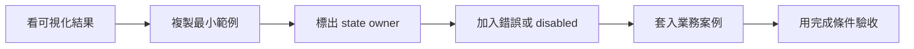

# 元件逐頁學習指南

App 內的「學習指南 → 元件」已把每個公開元件做成獨立頁。每頁不是只有函式簽章，而是固定
包含可操作預覽、可選取複製程式碼、逐步拆解、常見錯誤、業務案例、練習與完成條件。

Wiki 保留分類索引與較長的設計說明；精確參數請同時參考 [Components](Components) 與
repository 的 `docs/component-reference.md`。

## 如何學一個元件



不要用「看懂範例」當完成。至少要改變一個需求，例如加入 loading、permission、empty 或
repository failure，確認元件 contract 仍清楚。

## Actions

### Button

用途：觸發一個明確動作。主要 action 使用 Filled，次要 action 使用 Outline/Text，危險動作
使用 Danger tone，但仍需文字說明。

```kotlin
@Composable
fun SaveAction(
    canSave: Boolean,
    saving: Boolean,
    onSave: () -> Unit,
) {
    Button(
        text = if (saving) "儲存中…" else "儲存",
        onClick = onSave,
        enabled = canSave && !saving,
    )
}
```

業務案例：表單儲存。`canSave` 由 validation 推導，`saving` 由 repository operation 決定；
Button 不直接呼叫 API。

### ButtonGroup

用途：少量、互斥、需要立即看到的 action。

```kotlin
var displayMode by remember { mutableStateOf(DisplayMode.List) }
ButtonGroup(
    items = DisplayMode.entries.map { ButtonItem(it, it.label) },
    selected = displayMode,
    onSelect = { displayMode = it },
)
```

資料 value 使用 enum，不用翻譯後的 label。

### Dropdown 與 CloseButton

Dropdown 適合低頻次要動作；CloseButton 只表示 dismiss，不應偷偷執行刪除。

```kotlin
Dropdown(
    label = "匯出",
    items = listOf(DropdownItem("csv", "CSV"), DropdownItem("pdf", "PDF")),
    onSelect = onExport,
)
```

## Feedback

### Alert 與 Callout

Alert 顯示目前畫面內持續存在的結果；Callout 適合有標題、action 或額外內容的提醒。

```kotlin
saveError?.let {
    Alert(
        title = "儲存失敗",
        message = it,
        tone = Tone.Danger,
        dismissible = true,
        onDismiss = onClearError,
    )
}
```

錯誤 dismiss 只清除訊息；retry 應是另一個清楚 action。

### Badge、Progress、Spinner、Placeholder

- Badge：短狀態，必須有文字，不能只有顏色。
- Progress：已知比例 `0f..1f`。
- Spinner：未知時間等待。
- Placeholder：資料載入前的形狀骨架。

```kotlin
Badge("已付款", tone = Tone.Success, pill = true)
Progress(uploaded.toFloat() / total)
if (loading && total == null) Spinner()
Placeholder(Modifier.fillMaxWidth().height(24.dp))
```

### Toast / ToastHost

適合短暫、跨區域的結果；需要使用者處理的失敗留在內容中，不應自動消失。

## Disclosure 與 Surfaces

### Collapse、Accordion

Collapse 是受控展開；Accordion 適合 FAQ 等多組獨立內容。完成任務必須知道的資訊不可藏在
預設收合區。

### Card

```kotlin
Card(
    title = "專業版",
    subtitle = "適合成長團隊",
    footer = { Button("升級", onClick = onUpgrade) },
) {
    Paragraph("每月 NT$300，包含進階權限。")
}
```

若 footer 有多個 action，通常不再讓整張 Card 可點擊，避免互動目標衝突。

### ListGroup、Carousel

ListGroup 的 value 使用穩定 id；Carousel 只放可略過的導覽/展示，不放唯一的重要警告。

## Navigation

### Breadcrumb、Navbar、Tabs、Nav

共同 contract 是 `items + selected + onSelect`。Route/screen 擁有 selected，navigation 元件
只顯示與回報 intent。

```kotlin
Tabs(
    items = listOf(
        NavItem(SettingsTab.Profile, "個人資料"),
        NavItem(SettingsTab.Security, "安全性"),
    ),
    selected = selectedTab,
    onSelect = onTabSelected,
)
```

### Pagination

使用 1-based 頁碼。Query 或 filter 改變時回到第 1 頁；元件不負責 request。

### ScrollSpy

由 screen 提供 active section。共用元件不直接讀 DOM，因此 Desktop/Web 行為一致。

## Forms

所有欄位遵循 controlled contract：

```text
value / checked / values → 元件顯示
onValueChange             → 使用者 intent 回到 owner
errorText                 → owner 的驗證結果
```

### Text、Password、TextArea

```kotlin
var email by remember { mutableStateOf("") }
val validation = FormValidators.all(
    FormValidators.required(),
    FormValidators.email(),
).validate(email)

FormTextInput(
    value = email,
    onValueChange = { email = it },
    label = "Email",
    type = FormInputType.Email,
    required = true,
    errorText = validation.message,
)
```

`required = true` 只顯示標記，真正規則仍需 validator。Password 不應寫入 log 或長期保存。

### Select、MultiSelect、RadioGroup

- Select：選項多、空間有限。
- RadioGroup：選項少且需要直接比較。
- MultiSelect：多個值，使用 Set 避免重複。

所有 option value 使用 enum/id，不使用 label。

### Checkbox、Switch、Range

- Checkbox：同意條款或獨立選取。
- Switch：立即切換設定；若立刻寫後端，必須處理失敗回復。
- Range：連續範圍；若要求精確值，另提供文字輸入。

### FormSection、InputGroup、FilePicker、Actions

FormSection 依使用者任務分段。InputGroup 的 prefix/suffix 不取代 label。FilePicker 的 common
UI 只持有 metadata，真實檔案由 adapter 管理。FormActions 集中 submit/reset 並接收狀態。

## Overlay

### Modal、Confirm、Ask、Choice

所有 overlay 的 `visible` 由呼叫端擁有。Confirm 失敗時不自動關閉，讓使用者能 retry。

```kotlin
Confirm(
    visible = deleteVisible,
    title = "刪除帳號？",
    message = "此動作無法復原。",
    destructive = true,
    onDismiss = { if (!deleting) deleteVisible = false },
    onConfirm = onDelete,
)
```

Ask/Choice 將草稿變更與 confirm 分離；取消不應修改正式資料。

### Popup、Offcanvas、Popover、Tooltip

- Popup：自訂浮層。
- Offcanvas：篩選器或輔助流程。
- Popover：anchor 附近的短說明與 action。
- Tooltip：圖示提示，不能取代 `contentDescription`。

## Content 與 Articles

H1–H6 建立文件層級；DocumentRenderer 顯示強型別文件；MarkdownDocument 顯示字串；
MarkdownResource 載入共用資源。

GuideArticle、ArticleStep、ArticleCallout、CodeBlock 用來建立本書同樣的教學結構。

## 每個元件頁的完成條件

- 能不用看文件重建最小範例。
- 能指出 state owner 與每個 callback 的意圖。
- 至少加入一個 disabled/loading/error/empty 情境。
- 能說明此元件不適合使用的情境。
- 能套入一個真實業務案例，而不是只換文字。
