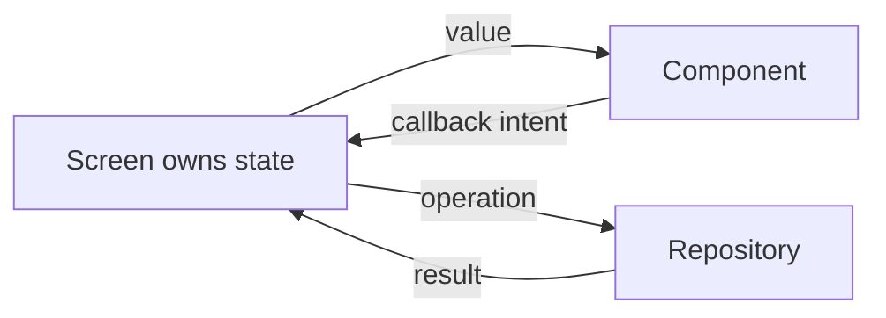

# Compose 概念篇

本章建立 ConsoleApp 框架最重要的 Compose 心智模型。元件 API 很短，但若不理解 state、
recomposition 與 effect，畫面仍會出現資料不同步、重複 request 或 `val cannot be reassigned`。

## 宣告式 UI

傳統命令式 UI 會要求你找到某個 view，再逐一修改文字、顏色與 enabled。Compose 的做法是：

> 給定目前 state，描述畫面現在應該長什麼樣子。

```kotlin
@Composable
fun SaveResult(saved: Boolean, error: String?) {
    when {
        error != null -> Alert(error, tone = Tone.Danger)
        saved -> Alert("已儲存", tone = Tone.Success)
        else -> Paragraph("尚未儲存")
    }
}
```

當輸入 state 改變，Compose 重新執行需要更新的部分。你不需要手動隱藏舊 Alert 再建立新 Alert。

## Recomposition

Composable 不是只執行一次。任何讀取到的 observable state 改變時，它可能再次執行。

```kotlin
@Composable
fun Counter() {
    var count by remember { mutableStateOf(0) }
    Text("Count: $count")
    Button("Add", onClick = { count += 1 })
}
```

因此 Composable 主體必須盡量沒有副作用。以下寫法可能在 recomposition 重複 request：

```kotlin
@Composable
fun Wrong(repository: Repository) {
    repository.load() // 錯誤：render 過程直接做 I/O
}
```

一次性或依 key 執行的載入使用 ViewModel，或明確使用 `LaunchedEffect(key)`：

```kotlin
@Composable
fun Correct(userId: String, onLoad: suspend (String) -> Unit) {
    LaunchedEffect(userId) {
        onLoad(userId)
    }
}
```

## remember 與生命週期

`remember` 保存跨 recomposition 的局部 UI state，但不等於永久資料庫。

適合 `remember`：

- Dialog 是否暫時展開。
- Password 是否顯示。
- Playground 的輸入草稿。

不適合只放 `remember`：

- 已儲存的帳號設定。
- 登入 session。
- 可跨頁返回的搜尋 query。
- 必須在 process 重啟後保留的資料。

## State hoisting：資料往下、事件往上



錯誤寫法：

```kotlin
@Composable
fun ThemeButton(themeMode: ThemeMode) {
    Button("切換", onClick = {
        themeMode = ThemeMode.Dark // 函式參數是 val，不能重新賦值
    })
}
```

正確寫法：

```kotlin
@Composable
fun ThemeButton(
    themeMode: ThemeMode,
    onThemeModeChanged: (ThemeMode) -> Unit,
) {
    Button("切換", onClick = {
        val next = when (themeMode) {
            ThemeMode.System -> ThemeMode.Light
            ThemeMode.Light -> ThemeMode.Dark
            ThemeMode.Dark -> ThemeMode.System
        }
        onThemeModeChanged(next)
    })
}

@Composable
fun App() {
    var themeMode by remember { mutableStateOf(ThemeMode.System) }
    ThemeButton(themeMode, onThemeModeChanged = { themeMode = it })
}
```

## 不要保存可推導的重複 state

```kotlin
var email by remember { mutableStateOf("") }
val validation = FormValidators.email().validate(email)
val canSave = email.isNotBlank() && validation.isValid
```

`validation` 與 `canSave` 都能從 `email` 推導，不必再建立可被改壞的 `mutableStateOf`。

## Modifier 的順序

Modifier 由左到右包裝行為：

```kotlin
Modifier
    .background(Color.Blue)
    .padding(16.dp)
```

背景包含 padding；換成：

```kotlin
Modifier
    .padding(16.dp)
    .background(Color.Blue)
```

背景只畫在 padding 內部。遇到排版問題時，先讀 Modifier 順序，而不是不斷增加固定尺寸。

## Effect 選擇

| API | 使用情境 |
| --- | --- |
| `LaunchedEffect(key)` | key 改變時啟動 coroutine |
| `DisposableEffect(key)` | 註冊後必須解除的 listener/resource |
| `rememberCoroutineScope()` | 由 click 等事件啟動 coroutine |
| `derivedStateOf` | 昂貴且會頻繁計算的衍生 state |
| ViewModel | 跨多個元件的業務流程、載入與 repository 狀態 |

## 穩定 key 與列表

列表的識別應使用穩定 id，不使用目前 index 或顯示文字。使用者排序、翻譯或刪除項目後，
Compose 才能把 state 對應到正確 item。

## 實際案例：可儲存設定

```kotlin
@Composable
fun NotificationSetting(
    enabled: Boolean,
    saving: Boolean,
    error: String?,
    onEnabledChange: (Boolean) -> Unit,
    onSave: () -> Unit,
) {
    FormSection(title = "通知") {
        FormSwitch(
            checked = enabled,
            onCheckedChange = onEnabledChange,
            label = "接收產品更新",
            enabled = !saving,
        )
        FormActions(
            onSubmit = onSave,
            submitText = if (saving) "儲存中…" else "儲存",
            submitEnabled = !saving,
        )
        error?.let { Alert(it, tone = Tone.Danger) }
    }
}
```

拆解：UI 沒有 repository；所有業務 state 由上層提供；使用者操作只透過 callback 回報；失敗
訊息是 state，因此重組後仍與資料一致。

## 常見錯誤

- 在 Composable 主體直接 request 或寫檔。
- 子元件同時保存一份與父層相同的業務 state。
- 使用 `remember` 隱藏錯誤的資料責任。
- callback 內同時導覽、寫資料、顯示訊息，沒有可測試邊界。
- Modifier 使用過多固定寬高，Desktop/Web 尺寸改變就破版。

## 完成條件

你應能從空白檔案寫出一個受控表單，說明每個 state 的擁有者，並能判斷一段 I/O 應放在
event、effect、ViewModel 或 platform adapter。
