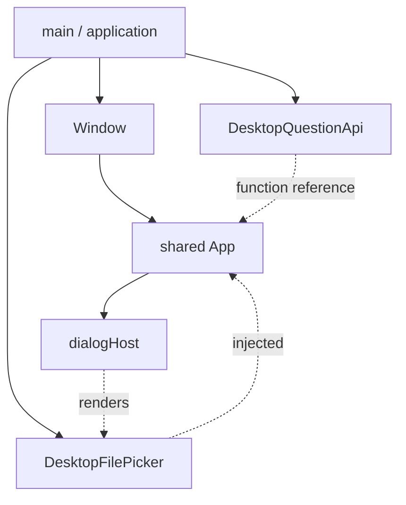
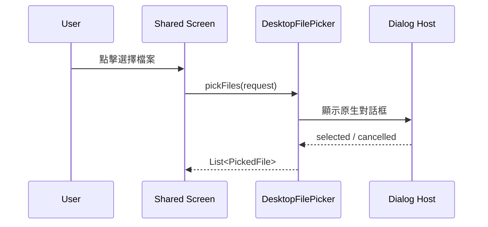

# DesktopApp 框架概念與實作

`desktopApp` 是 JVM 應用外殼：建立 application 與 Window、處理生命週期、建立 Desktop
adapter，並將它們注入 shared App。它不應複製一套 Desktop 專用 feature UI。

## 啟動與依賴圖



## 專案中的入口

```kotlin
fun main() = application {
    val filePicker = remember { DesktopFilePicker() }
    val questionApi = remember {
        DesktopQuestionApi("http://localhost:8000/api/upload")
    }

    Window(
        onCloseRequest = ::exitApplication,
        title = "ConsoleApp",
        state = rememberWindowState(
            width = 1024.dp,
            height = 768.dp,
            placement = WindowPlacement.Maximized,
        ),
    ) {
        App(
            submitQuestion = questionApi::submit,
            filePicker = filePicker,
            dialogHost = { filePicker.Host() },
        )
    }
}
```

### 逐步拆解

1. `application` 管理 JVM app lifecycle。
2. `remember` 避免 recomposition 時重建持有資源的 adapter。
3. `Window` 負責標題、尺寸、placement 與 close request。
4. `questionApi::submit` 是函式參考，簽章符合 shared App 所需 callback。
5. `dialogHost` 讓需要 Composable host 的原生對話框掛入畫面樹。
6. Feature UI 仍由 `shared App` 提供。

## Desktop adapter 原則

Desktop 可以使用 JVM、Swing、AWT 或 OkHttp，但應包裝在小型 adapter 內。Shared 不應知道：

- `java.io.File`。
- Swing window owner。
- OS path separator。
- OkHttp request body。
- Windows/macOS/Linux 的 dialog 差異。

## 原生檔案選擇流程



取消是正常結果，例外才是錯誤。Adapter 還應處理 extension filter、multiple selection、檔案
大小與 bytes 讀取失敗。

## Window state 與 feature state 不同

Window state 包含尺寸、位置、最小化與關閉。Feature state 包含表單草稿、目前頁面與儲存結果。
不要把兩者混在同一個 data class；它們的生命週期與測試方式不同。

## 網路 adapter

```kotlin
class DesktopQuestionApi(
    private val endpoint: String,
    private val client: OkHttpClient = OkHttpClient(),
) {
    suspend fun submit(question: String, file: PickedFile) {
        withContext(Dispatchers.IO) {
            // 建立 request、檢查 status，將技術錯誤轉成 domain error
        }
    }
}
```

不要在 UI thread 執行 blocking I/O。Repository/API 還要定義 timeout、取消與 error mapping。

## 開發執行

```powershell
.\gradlew.bat :desktopApp:hotRun --auto
.\gradlew.bat :desktopApp:run
```

若 Gradle 找不到 Java，先確認 `JAVA_HOME` 指向有效 JDK 目錄。JDK 版本也必須符合 Gradle
與 Compose plugin 要求。

## 封裝

```powershell
.\gradlew.bat :desktopApp:createDistributable
.\gradlew.bat :desktopApp:packageDistributionForCurrentOS
```

`jpackage` 不能跨平台產生原生 installer：

| 執行環境 | 可產出 |
| --- | --- |
| Windows | `.exe`、`.msi` |
| macOS | `.dmg` |
| Linux | `.deb`、`.rpm` |

因此 release workflow 應以 OS matrix 平行建置，再把 artifacts 放入同一個 release。

## 實際業務案例：關閉前確認未儲存資料

設計流程：

1. Feature state 提供 `hasUnsavedChanges`。
2. Window close request 不直接退出，而是觸發 close intent。
3. 有未儲存資料時顯示 Confirm。
4. 使用者確認才呼叫 `exitApplication`。
5. 使用者取消則保留 Window 與草稿。

這個流程不應讓 `Confirm` 自己直接知道如何關閉 JVM app；它只回報 confirm/dismiss。

## 測試策略

- `commonTest`：validation、state transition、fake repository。
- `desktopApp` unit test：path/filter/error mapping。
- 手動 UI：Window resize、keyboard、file dialog owner、取消與多選。
- packaging smoke test：在乾淨機器執行 distributable，不依賴系統 Java。

## 常見錯誤

- 在 Composable 每次重組建立 OkHttp client。
- Blocking I/O 留在 UI thread。
- `Window` callback 直接丟失未儲存資料。
- Shared model 暴露 `java.io.File`。
- 在 Windows 建置時期待產生 macOS `.dmg`。
- Installer 可建置就視為完成，沒有在乾淨環境 smoke test。

## 驗收清單

- Desktop 專屬 API 只在 adapter 或入口。
- Window 可縮放，內容不依賴固定尺寸。
- 原生 dialog 有正確 owner，取消不顯示錯誤。
- Network 與 file I/O 支援取消並離開 UI thread。
- 可攜版包含 JRE，在無 Java 機器可執行。
