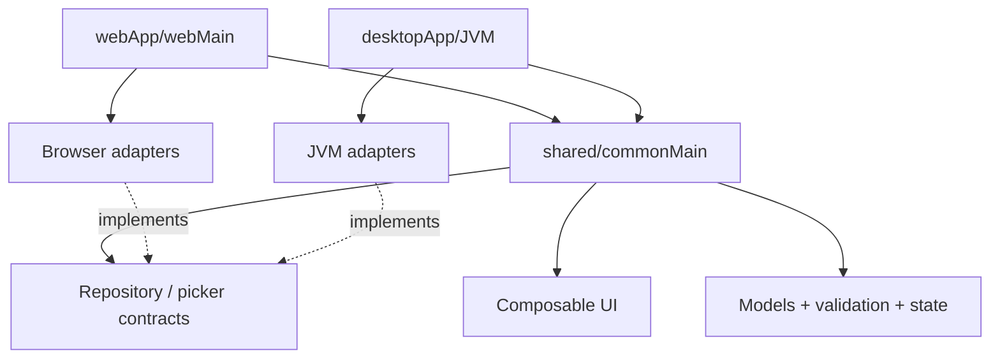
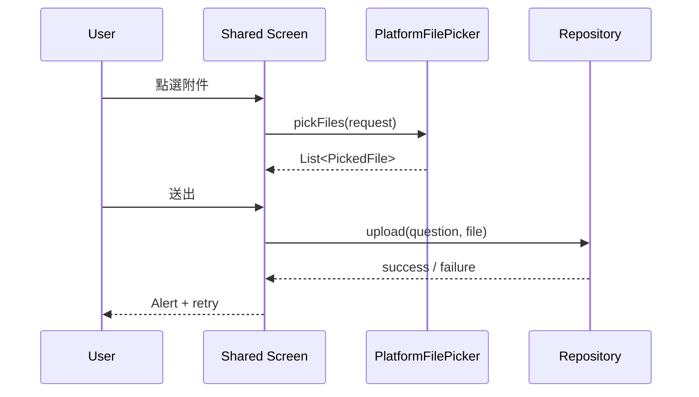

# Kotlin Shared 與 commonMain

`shared` 是產品的跨平台核心，不是「所有程式碼都丟進去」的資料夾。它只依賴所有目標平台
都能理解的 API，並以 contract 向平台要求能力。

## 模組責任圖



## 適合放在 commonMain

- Design system 與 feature Composable。
- Data class、enum、sealed UI state。
- 表單驗證與純商業規則。
- Repository、file picker、clock 等 contract。
- 跨平台 coroutine 流程。
- `commonTest` 的規則與 state 測試。

## 不應直接放在 commonMain

- `java.io.File`、Swing、AWT。
- Browser DOM、`window`、JavaScript `File`。
- OkHttp 的具體 client（若只有 Desktop 依賴）。
- OS 安裝路徑與視窗設定。
- 平台特有 permission dialog。

## Contract-first 設計

```kotlin
data class FilePickerRequest(
    val title: String,
    val allowMultiple: Boolean,
    val allowedExtensions: Set<String>,
)

data class PickedFile(
    val name: String,
    val sizeBytes: Long,
    val readBytes: suspend () -> ByteArray,
)

interface PlatformFilePicker {
    suspend fun pickFiles(request: FilePickerRequest): List<PickedFile>
}
```

Contract 描述產品真正需要的能力，不應把某平台完整 API 原封不動複製到 shared。

## 依賴注入的位置

平台入口是 composition root：

```kotlin
// Desktop main
val filePicker = remember { DesktopFilePicker() }
App(filePicker = filePicker)
```

```kotlin
// Web main
val filePicker = BrowserFilePicker()
App(filePicker = filePicker)
```

`App` 與 feature screen 只知道 `PlatformFilePicker`，因此能用 fake：

```kotlin
class FakeFilePicker(
    private val result: List<PickedFile>,
) : PlatformFilePicker {
    override suspend fun pickFiles(request: FilePickerRequest) = result
}
```

## Source set 的學習方式

```text
shared/
├── src/commonMain    所有平台共用
├── src/commonTest    共用測試
├── src/jvmMain       shared module 的 JVM actual/adapter
├── src/jsMain        JS 專屬 actual
└── src/wasmJsMain    Wasm 專屬 actual
```

外層 `desktopApp` 與 `webApp` 是應用入口，可以依賴 shared。先區分「library platform source set」
與「application module」，不要只看名稱猜責任。

## expect / actual 何時使用

只有當 API 本質上是同一個能力、實作又必須編譯期依平台選擇時才考慮 `expect/actual`。
若能力需要不同設定、可替換 fake，或應在 runtime 注入，普通 interface 通常更簡單。

適合 `expect/actual`：

- 很小的 platform name 或 system primitive。
- 平台 API 形狀一致且不需要 runtime 替換。

適合 interface injection：

- File picker、network service、repository、clock。
- 需要 fake、Preview 或不同產品實作。

## 純驗證規則

```kotlin
data class Profile(
    val name: String,
    val email: String,
)

data class ProfileValidation(
    val nameError: String? = null,
    val emailError: String? = null,
) {
    val isValid: Boolean get() = nameError == null && emailError == null
}

fun validateProfile(value: Profile) = ProfileValidation(
    nameError = if (value.name.isBlank()) "名稱必填" else null,
    emailError = FormValidators.email().validate(value.email).message,
)
```

這段沒有 UI 與平台依賴，最適合放在 commonMain 並用 commonTest 驗證。

## commonTest 範例

```kotlin
class ProfileValidationTest {
    @Test
    fun rejectsBlankNameAndInvalidEmail() {
        val result = validateProfile(Profile("", "invalid"))

        assertFalse(result.isValid)
        assertNotNull(result.nameError)
        assertNotNull(result.emailError)
    }
}
```

## 實際業務案例：附件送出



Shared screen 管理 selected files、submitting 與 result；平台 picker 只選檔；repository 只送資料。

## 常見錯誤

- 為了「共用」把平台 if/else 散落在 feature screen。
- Contract 暴露 `java.io.File`，導致 Web 無法實作。
- Composable 同時建立 network client，難以測試也容易重建。
- 把所有平台差異都強迫成 `expect/actual`，失去 fake injection。
- commonMain 只有 UI，商業規則仍複製在 Desktop/Web。

## 完成條件

能建立一個 shared contract、Desktop/Web 兩個實作與一個 fake；feature UI 不修改即可交換三者。
