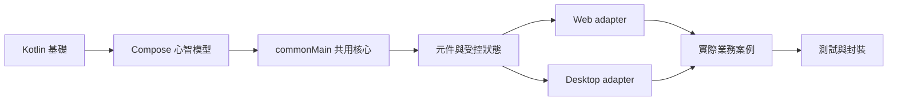
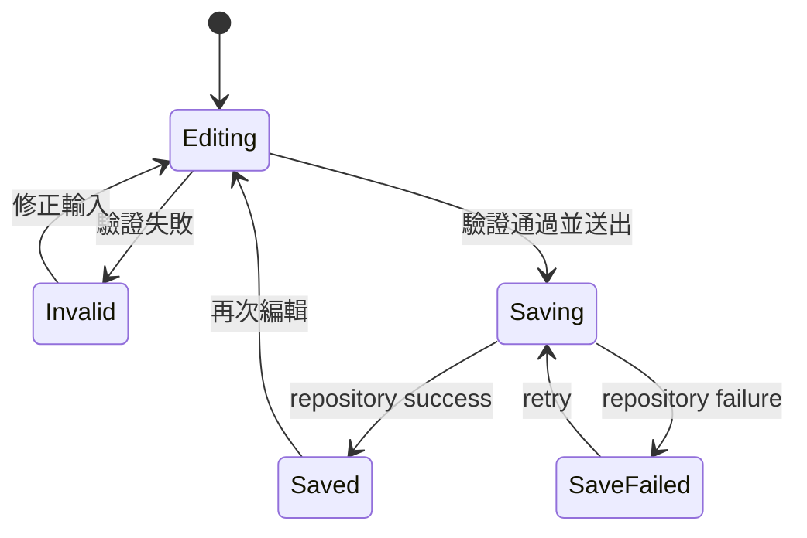

# ConsoleApp 完整學習路徑

這不是「把 API 從頭讀到尾」的清單，而是一條以作品為核心的學習路徑。終點是完成一個
Desktop 與 Web 共用的帳號設定功能，包含驗證、非同步儲存、錯誤恢復、確認視窗與測試。

## 先備知識與學習成果

開始前應理解 Kotlin 的 `val`、`var`、函式、lambda、data class 與基本 coroutine。完成後應能：

1. 解釋 Compose 的宣告式 UI、recomposition 與 state hoisting。
2. 判斷程式應放在 `commonMain`、`webMain` 或 `desktopApp`。
3. 使用公開元件 API 組合畫面，不散落固定色碼與業務副作用。
4. 以 `value + callback` 建立可測試的受控元件。
5. 用 repository 與 platform adapter 隔離 I/O。
6. 為 loading、success、error、empty 與 retry 建立完整流程。

## 路徑總圖



## 第一階段：建立心智模型

預估時間：3～5 小時。

閱讀順序：

1. [Compose Concepts](Compose-Concepts)
2. [Architecture](Architecture)
3. [Kotlin Shared](Kotlin-Shared)

不要急著背所有元件。這一階段只需能回答：

- 當 state 改變時，畫面為什麼會更新？
- 為什麼函式參數 `themeMode` 不能直接重新賦值？
- 為什麼 `commonMain` 不應直接使用 `java.io.File`？
- UI callback 與 repository operation 的責任有什麼不同？

### 小練習

```kotlin
@Composable
fun Counter() {
    var count by remember { mutableStateOf(0) }

    Column {
        Text("目前數量：$count")
        Button("增加", onClick = { count += 1 })
    }
}
```

把 `count` 與 callback 提升到呼叫端，讓 `CounterContent` 變成受控元件：

```kotlin
@Composable
fun CounterContent(count: Int, onIncrease: () -> Unit) {
    Column {
        Text("目前數量：$count")
        Button("增加", onClick = onIncrease)
    }
}
```

完成條件：你能說明哪一個函式「擁有」狀態，以及純內容元件為何更容易 Preview 與測試。

## 第二階段：用語意元件完成畫面

預估時間：4～6 小時。

先學這些高頻元件：

- 內容：`H1`、`Paragraph`、`Card`
- 動作：`Button`、`Dropdown`
- 回饋：`Alert`、`Progress`、`Spinner`
- 表單：`FormTextInput`、`FormSwitch`、`FormActions`
- Overlay：`Confirm`、`Modal`

```kotlin
@Composable
fun ProfileSummary(
    name: String,
    saving: Boolean,
    onEdit: () -> Unit,
) {
    Card(
        title = "個人資料",
        footer = {
            Button(
                text = if (saving) "處理中…" else "編輯",
                onClick = onEdit,
                enabled = !saving,
            )
        },
    ) {
        Paragraph("目前顯示名稱：$name")
        if (saving) Progress(0.5f)
    }
}
```

逐步拆解：

1. `ProfileSummary` 不知道資料來自 API、database 或 Preview。
2. `saving` 決定顯示內容與按鈕是否可操作。
3. `onEdit` 只回報 intent，導覽與資料操作留給呼叫端。
4. 元件使用 theme 與 tone，不自行寫死品牌顏色。

完成條件：能在明暗主題下完成一個資訊頁，並為每個 callback 指出真正的處理者。

## 第三階段：表單與狀態機

預估時間：6～10 小時。

完整表單不是一組欄位，而是一個狀態流程：



建議 state：

```kotlin
data class ProfileUiState(
    val draft: Profile,
    val nameError: String? = null,
    val emailError: String? = null,
    val saving: Boolean = false,
    val saved: Boolean = false,
    val saveError: String? = null,
) {
    val canSave: Boolean
        get() = !saving && nameError == null && emailError == null
}
```

完成條件：驗證失敗不呼叫 repository；送出中不能重複點擊；失敗後保留草稿並可 retry。

## 第四階段：平台 adapter

分別閱讀 [WebMain Guide](WebMain-Guide) 與 [DesktopApp Guide](DesktopApp-Guide)。

共同原則是先在 shared 定義能力：

```kotlin
interface FilePicker {
    suspend fun pick(request: FilePickerRequest): List<PickedFile>
}
```

再由平台提供實作：

```text
shared App ← FilePicker contract
     ↑                 ↑
BrowserFilePicker   DesktopFilePicker
```

完成條件：共用畫面可以使用 fake picker 測試，不需要瀏覽器或 Swing。

## 第五階段：實戰與測試

完成 [Business Case Study](Business-Case-Study)，至少涵蓋：

- 載入初值。
- 編輯 draft。
- 純函式驗證。
- 非同步儲存。
- 成功與失敗回饋。
- Reset confirmation。
- Fake repository 測試。
- Desktop 與 Web 手動驗證。

## 四週建議進度

| 週次 | 主題 | 可交付成果 |
| --- | --- | --- |
| 1 | Kotlin、Compose、Shared | 可受控的 Counter 與 Welcome screen |
| 2 | 元件、表單、驗證 | 可驗證的 Profile form |
| 3 | WebMain、DesktopApp、Repository | 兩平台共用畫面與 fake adapter |
| 4 | 實戰、測試、封裝 | Account Settings 完整作品 |

## 自我評量

不要用「讀完」判斷學會。使用以下證據：

- 關閉文件後能重寫核心範例。
- 能刻意製造 repository failure，畫面仍可恢復。
- 能交換 fake 與真實 adapter，不修改 feature UI。
- 能說明每一個 state 的擁有者與生命週期。
- 能替新元件寫出一篇包含範例、拆解、業務案例與完成條件的教學。
