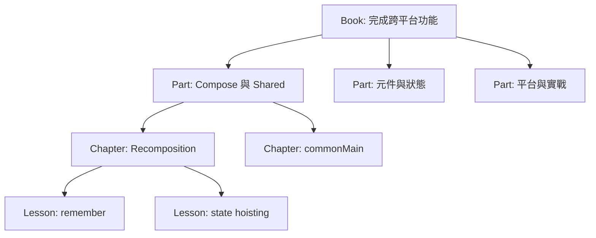

# 如何規劃框架教學書與篇章

好的技術書不是 API 清單加幾段描述，而是把讀者從「目前能力」帶到「能獨立完成任務」。
ConsoleApp 的 App 內 Guide Book 與 Wiki 都採同一套篇章模型。

## 從成果倒推，而不是從檔案結構開始

先寫出完成證據：

```text
讀者：會 Kotlin 語法，第一次接觸 Compose Multiplatform
任務：建立可儲存的帳號設定頁
成功證據：
- Desktop 與 Web 都能操作
- 驗證失敗不送出
- 儲存失敗保留草稿並可重試
- fake repository 測試成功與失敗
```

再倒推需要的知識：Compose state → 表單元件 → validation → repository → platform adapter → test。

## 書籍層級



- Book 有一個可展示的總成果。
- Part 建立一組相關能力。
- Chapter 解決一個學習目標。
- Lesson 只引入一個主要新概念。
- Reference page 精確描述單一元件或 API。

## 每個教學頁固定七段

1. **使用情境**：這個知識解決什麼問題。
2. **心智模型**：用一句規則建立理解。
3. **可視化結果**：先看到最後會做出的畫面或流程。
4. **完整可複製範例**：定義 import、state、callback 與必要 model。
5. **逐步拆解**：說明資料如何流動，不只是逐行翻譯語法。
6. **實際業務案例**：加入 loading、error、permission 或 retry。
7. **練習與完成條件**：讓讀者改變需求並驗證結果。

## 範例品質標準

不完整範例：

```kotlin
Button("Save", onClick = ::save)
```

問題是讀者不知道 `save` 在哪裡、是否 suspend、誰處理錯誤，以及 loading 如何呈現。

可學習範例：

```kotlin
interface SettingsRepository {
    suspend fun save(value: Settings)
}

@Composable
fun SaveSettingsAction(
    value: Settings,
    repository: SettingsRepository,
) {
    var saving by remember { mutableStateOf(false) }
    var result by remember { mutableStateOf<String?>(null) }
    val scope = rememberCoroutineScope()

    Button(
        text = if (saving) "儲存中…" else "儲存",
        enabled = !saving,
        onClick = {
            scope.launch {
                saving = true
                result = runCatching { repository.save(value) }
                    .fold(
                        onSuccess = { "儲存成功" },
                        onFailure = { it.message ?: "儲存失敗" },
                    )
                saving = false
            }
        },
    )
    result?.let { Alert(it) }
}
```

這個版本仍可繼續改良為 ViewModel，但已完整顯示狀態、依賴與失敗路徑。

## 可視化不是裝飾

適合使用視覺化的內容：

- 資料流：UI → callback → ViewModel → repository → result → UI。
- 狀態機：idle、loading、success、error、retry。
- 模組責任：shared、webApp、desktopApp。
- 元件層級：screen、section、field、primitive。

不需要為單一參數畫圖。圖必須回答文字不容易快速看懂的關係。

## 如何拆解程式碼

不要逐行說「這一行建立變數」。應回答：

- 這個 state 為何存在？誰擁有？生命週期多長？
- callback 回報的是 intent 還是已完成的 result？
- 失敗時資料是否保留？使用者下一步是什麼？
- 哪些規則可用純函式測試？
- 哪些依賴是平台專屬？如何注入？

## 業務案例的最低完整度

每個案例至少處理：

| 面向 | 要回答的問題 |
| --- | --- |
| Data | 初值從哪裡來？草稿與已儲存資料如何區分？ |
| Validation | 前端與後端各驗證什麼？ |
| Loading | 如何避免重複操作？ |
| Failure | 顯示在哪裡？能否 retry？草稿是否保留？ |
| Permission | 哪些動作 disabled 或隱藏？ |
| Accessibility | 是否只有顏色？圖示是否有描述？ |
| Test | 哪些結果可由 fake 驗證？ |

## 篇章 review checklist

- 標題描述任務或能力。
- 範例沒有未定義的 `viewModel`、`items`、`onSave`。
- 程式碼與 repository 當前 API 一致。
- 至少一個非 happy path。
- 有可觀察的完成條件。
- 有下一章與參考頁連結。
- Desktop 與 Web 差異有標示。
- 讀者能複製範例後只做少量替換就執行。
