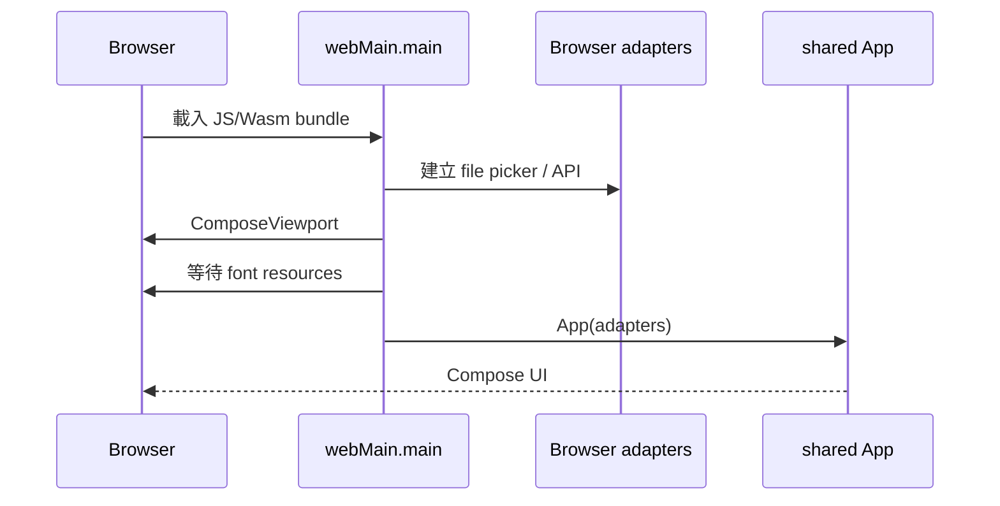

# WebMain 框架概念與實作

`webApp` 是瀏覽器應用的外殼。它負責啟動 Compose、等待 Web 資源、建立瀏覽器 adapter，
再把這些能力注入 `shared` 的 `App`。業務 UI 不應在 Web 再寫一份。

## 啟動流程



## 專案中的入口

```kotlin
@OptIn(ExperimentalComposeUiApi::class)
fun main() {
    val filePicker = BrowserFilePicker()
    val questionApi = WebQuestionApi(
        "http://localhost:8000/api/upload",
        filePicker = filePicker,
    )

    ComposeViewport {
        WithFontResourcesLoaded {
            App(
                submitQuestion = questionApi::submit,
                filePicker = filePicker,
            )
        }
    }
}
```

### 逐步拆解

1. `main` 是 Web composition root，不承載 feature UI。
2. `BrowserFilePicker` 封裝瀏覽器 File API。
3. `WebQuestionApi` 封裝 request 與瀏覽器檔案資料。
4. `ComposeViewport` 建立 Compose 的瀏覽器繪製入口。
5. `WithFontResourcesLoaded` 避免字型尚未就緒時先顯示錯誤尺寸。
6. `App` 仍來自 shared，與 Desktop 使用同一套畫面。

## JS 與 Wasm 目標

專案同時設定 `js { browser() }` 與 `wasmJs { browser() }`。兩者都依賴 shared，但工具鏈與
第三方 library 支援程度可能不同。不要假設 JVM library 能直接在兩者使用。

執行：

```shell
./gradlew :webApp:jsBrowserDevelopmentRun
./gradlew :webApp:wasmJsBrowserDevelopmentRun
```

Windows PowerShell：

```powershell
.\gradlew.bat :webApp:jsBrowserDevelopmentRun
.\gradlew.bat :webApp:wasmJsBrowserDevelopmentRun
```

## Browser adapter 的邊界

Shared contract：

```kotlin
interface ExternalLinkOpener {
    fun open(url: String): Boolean
}
```

Web 實作可以使用 browser API，但 shared screen 只依賴 contract：

```kotlin
class BrowserExternalLinkOpener : ExternalLinkOpener {
    override fun open(url: String): Boolean {
        window.open(url, target = "_blank", features = "noopener,noreferrer")
        return true
    }
}
```

實際產品還要限制 URL scheme 與可信 domain，不能讓不受信任內容任意開啟連結。

## Web request 的狀態設計

```kotlin
sealed interface SubmitState {
    data object Idle : SubmitState
    data object Submitting : SubmitState
    data object Success : SubmitState
    data class Failure(val message: String) : SubmitState
}
```

UI 只根據狀態顯示；CORS、HTTP status、timeout 與 response parsing 由 Web service/repository
轉成產品可理解的 result。

## 實際業務案例：上傳附件

```kotlin
@Composable
fun AttachmentQuestion(
    filePicker: PlatformFilePicker,
    submit: suspend (String, PickedFile) -> Unit,
) {
    var question by remember { mutableStateOf("") }
    var files by remember { mutableStateOf(emptyList<PickedFile>()) }
    var submitting by remember { mutableStateOf(false) }
    var error by remember { mutableStateOf<String?>(null) }
    val scope = rememberCoroutineScope()

    FormFilePicker(
        fileNames = files.map { it.name },
        onPick = {
            scope.launch {
                files = filePicker.pickFiles(
                    FilePickerRequest(
                        title = "選擇附件",
                        allowMultiple = false,
                        allowedExtensions = setOf("pdf", "png", "jpg"),
                    ),
                )
            }
        },
        onClear = { files = emptyList() },
        label = "附件",
    )
    FormTextArea(question, { question = it }, label = "問題")
    FormActions(
        onSubmit = {
            val file = files.firstOrNull() ?: return@FormActions
            scope.launch {
                submitting = true
                error = runCatching { submit(question, file) }.exceptionOrNull()?.message
                submitting = false
            }
        },
        submitEnabled = !submitting && question.isNotBlank() && files.isNotEmpty(),
    )
    error?.let { Alert(it, tone = Tone.Danger) }
}
```

這個畫面仍可在 Desktop 使用，因為它只依賴 shared contract。

## Web 常見問題

### CORS

瀏覽器會限制跨來源 request。CORS 必須由 API server 正確回應；不要在 UI 用奇怪 proxy
或關閉瀏覽器安全功能當成正式修復。

### Font 或資源閃爍

確認 resource loading wrapper；避免 render 前後字型尺寸差異造成 layout shift。

### 檔案取消

使用者取消 picker 是正常流程，通常回傳空 list，不應顯示「系統錯誤」。

### Browser navigation

若加入 URL routing，route 應成為 page state 的來源。不要讓 Navbar 擁有另一份不同步的
selected state。

## 驗收清單

- JS 與 Wasm 至少選定一個正式 target 並持續測試。
- API endpoint 不是散落在 Composable。
- CORS、timeout、HTTP error 有使用者可理解的結果。
- File picker 取消、空檔案、過大檔案有處理。
- Browser API 只出現在 Web adapter。
- Shared feature 可用 fake adapter 測試。
